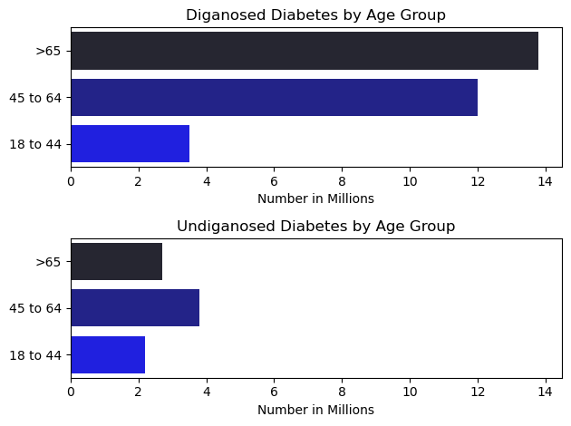
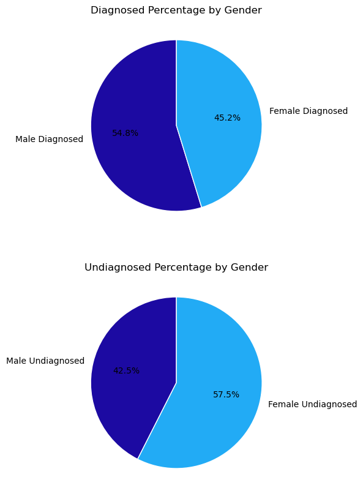
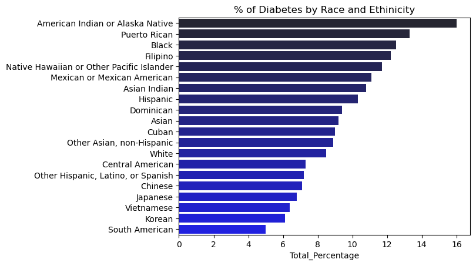
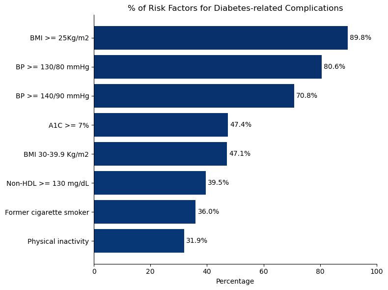
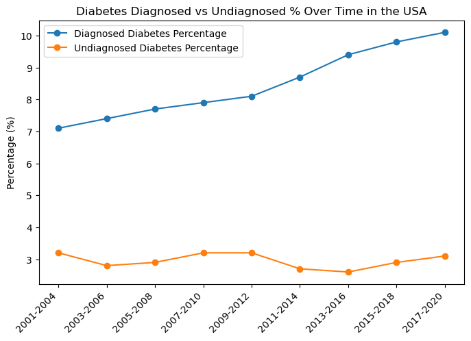
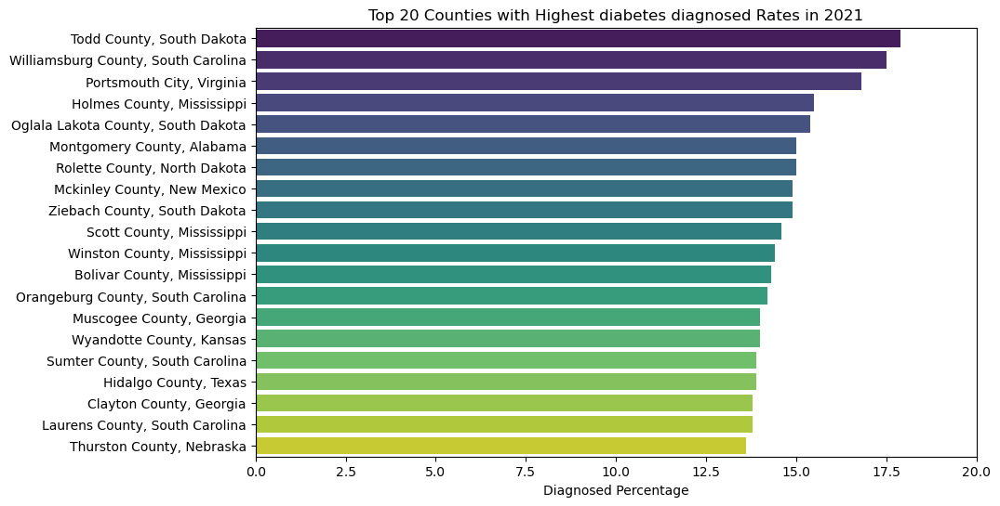
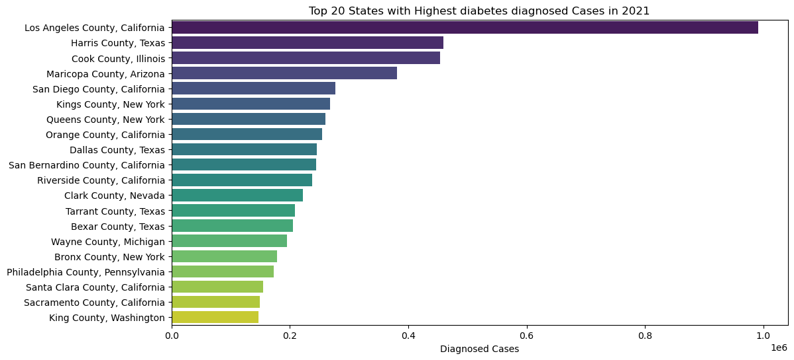
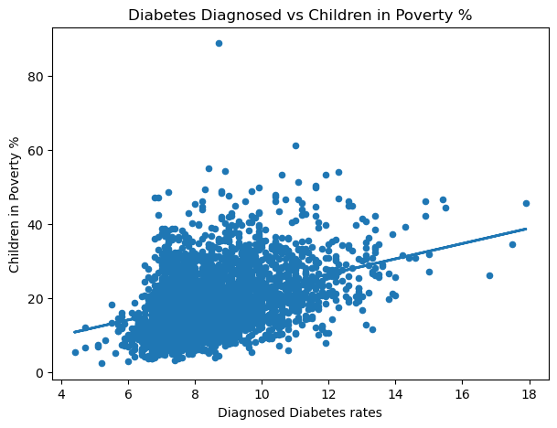
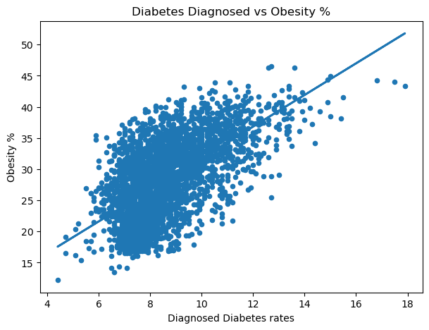

# Diabetes USA Market Analysis

## Overview:

Welcome to my analysis of diabetes mellitus, focusing on disease analysis in the USA and Marketing analysis for the top 5 drugs in the US managing this disease. Diabetes mellitus is a condition that happens when your blood sugar (glucose) is too high. It develops when your pancreas doesn’t make enough insulin or any at all, or when your body isn’t responding to the effects of insulin properly. This project was created out of a desire to understand the disease burden, its prevalence, risk factors, occurrence at the county level, and to analyze the marketing strategies of the top 5 drugs. It delves into the disease status in the USA market and companies' marketing performance to help find optimal marketing activities to tackle this disease.

The data was sourced from two separate sources; the USA disease data was sourced from the Centers for Disease Control and Prevention (CDC) website. The disease data contains detailed information on age groups, genders, diagnosed percentage per county, risk factors, obesity percentages/county for US race and ethnicity, Social Vulnerability Index (SVI)/county, and diagnosed/undiagnosed percentages across years. Due to the proprietary nature of pharmaceutical sales/marketing data, this project utilized a simulated dataset that mirrors a real-world scenario. The simulated data was supplemented with real figures for drug sales and marketing expenditures from the company's 10-K filing, as well as trusted blogs on pharma websites, such as xtalks. The data was created to demonstrate my ability to analyze key marketing metrics, including market share, sales trends, and campaign or channel effectiveness. The simulated data contains detailed information on drug name, company, prescriptions filled, new prescriptions, sales, marketing spend on digital Ads, marketing spend on Healthcare professionals, and prescription dates.

## Tools I Used:
For my deep dive into the data analyst job market, I harnessed the power of several key tools:
  - Python: The backbone of my analysis, allowing me to analyze the data and find critical insights. I also used the following Python libraries:
      - Pandas Library: This was used to analyze the data.
      - Matplotlib Library: I used it to visualize the data.
      - Seaborn Library: Helped me create more advanced visuals.
  - Jupyter Notebooks: The tool I used to run my Python scripts, which let me easily include my notes and analysis.
  - Visual Studio Code: My go-to for executing my Python scripts.

## The Questions (A):
The questions are divided into two parts, the Medical Part and the Marketing Part:
**A**- Diabetes Disease State Questions:
      - What are the demographic characteristics of the American population with diabetes?
      - What are the most prevalent health risk factors among people with diabetes?
      - How has the percentage of undiagnosed and diagnosed diabetes changed over time in the US?
      - Which US counties have the highest diagnosed diabetes cases, and what is the total population of the cases in those counties?
      - What are the top 20 states with the highest overall percentage of diagnosed diabetes?
      - What are the top 20 counties/states with the highest overall cases of diagnosed diabetes?
      - How does the percentage of children in poverty correlate with diagnosed diabetes rates at the county level?
      - What is the relationship between the overall obesity rate and the diagnosed diabetes rate at the county level? 

## The Analysis:
The Jupyter notebook for this part (01_Patient_Profile.ipynb) of the project aimed at investigating specific aspects of the US diabetes disease state. Here’s how I approached each question:

### What are the demographic characteristics of the American population with diabetes?

To find the main demographics of the American population with diabetes, I filtered the data for the age groups of diabetes diagnosed/undiagnosed, then I filtered for the gender diagnosed/undiagnosed diabetes percentage, and then for the percentage of diabetes diagnosed for each ethnic group. I plotted a subplots bar chart for the age group to identify the difference between the groups diagnosed and the undiagnosed numbers. In the same way, I plotted subplot pie charts for the gender data. For the ethnic groups data, I plotted it on a bar chart to demonstrate the differences in diabetes occurrence across different ethnicities.

### Results

### Insights

At first glance at the above graphs, I could realize that:

**Age-Group Insights**

The "Age Groups Diabetes" graph  demonstrates a strong correlation between age and the prevalence of diabetes.
  - The highest age group diagnosed with diabetes is people over 65 years old, with almost 14 million diagnosed cases. Followed by the second-highest age group of people aged from 45 to 64 years old. That means the prevalence of diagnosed, undiagnosed, and total diabetes increases dramatically with age. The highest undiagnosed age group is the age group of 45 to 65 years old.

**Gender Demographics**

The "Diabetes by Gender" graph  reveals a clear distinction in the prevalence of diagnosed, undiagnosed, and total diabetes between men and women.
  - Men have a higher prevalence of total diabetes compared to women. Women show a larger gap between diagnosed and undiagnosed cases. This indicates that a significant portion of diabetes in the female population remains undiagnosed, highlighting a potential need for increased screening and public health outreach targeted at women.

**Race and Ethnicity Demographics**

The "Race and Ethnicity" graph  highlights significant disparities in diabetes rates among different racial and ethnic groups.
  - Hispanic, non-Hispanic Black, and non-Hispanic Asian populations have a higher overall prevalence of diabetes compared to non-Hispanic White populations.

### What are the most prevalent health risk factors among people with diabetes?

The data for the risk factors comes in a separate sheet, and it only needs data processing. Cleaning columns and converting data to numeric type (float). Then plot the data on a bar chart. The chart below is for the risk factors - related complications. Since the CDC Statistics website only provides data for 2 risk factors, obesity and physical inactivity. 

    fig, ax = plt.subplots(figsize=(8,6))
    
    # Horizontal bar chart
    bars = ax.barh(
        df_risk_top8['Risk factors for diabetes-related complications'],
        df_risk_top8['Percentage'],
        color=plt.cm.Blues_r(range(len(df_risk_top8)))
    )
    
    # Add percentage labels to bars
    ax.bar_label(bars, fmt='%.1f%%', padding=3, color="black", fontsize=10)
    ax.set_title('% of Risk Factors for Diabetes-related Complications')
    ax.set_xlabel("Percentage")
    ax.set_ylabel("")
    ax.spines['top'].set_visible(False)
    ax.spines['right'].set_visible(False)
    ax.set_xlim(0, 100)
    ax.invert_yaxis()
    plt.tight_layout()
    plt.show()

### Results

### Insights

This chart breaks down the percentages of various risk factors for adults diagnosed with diabetes. 

  - **Obesity** is the most widespread risk factor, in which the graph shows that almost 90% of adults with diagnosed diabetes are either overweight or obese (BMI ≥25.0 kg/m²). This is the most prevalent risk factor documented on the chart and should be a primary focus for any intervention or public health campaign.

  - **High blood pressure** is a major concern. A large proportion of the population with diabetes (70.6%) also has high blood pressure, highlighting the interconnectedness of these conditions. This finding suggests a need for a holistic approach to patient care that addresses both blood sugar and blood pressure control.

  - **Poorly managed A1C levels** are highly common, in which a significant percentage (47.4%) of the diabetic population has an A1C level of 7.0% or higher, indicating they are not meeting their glycemic control goals. This points to a critical need for better patient education and management strategies to prevent complications.

  - **Lifestyle** factors like physical inactivity are a significant problem for patients and a leading cause of diabetes. About one-third (31.9%) of adults with diabetes are physically inactive. This is an important, modifiable risk factor that can be targeted through campaigns promoting exercise and physical activity.

  - A substantial portion of the population with diabetes are current or former **smokers**. Around 58% of the population with diabetes are either current or former cigarette smokers, which is another significant risk factor for diabetes-related complications.

### How has the percentage of undiagnosed and diagnosed diabetes changed over time in the US?

    plt.figure(figsize=(8, 5))
    plt.plot(diagnosed_over_time['Time Period'], diagnosed_over_time['Diagnosed_diabetes_Percentage'], marker='o', label='Diagnosed Diabetes Percentage')
    plt.plot(undiagnosed_over_time['Time Period'], undiagnosed_over_time['Undiagnosed_diabetes_Percentage '], marker='o', label='Undiagnosed Diabetes Percentage')
    plt.title('Diabetes Diagnosed vs Undiagnosed % Over Time in the USA')
    plt.legend()
    plt.ylabel('Percentage (%)')
    plt.xticks(rotation = 45, ha = 'right')
        
    plt.show()
    plt.tight_layout()

### Result

### Insights

  - The most significant trend is the steady increase in the total percentage of people with diabetes over the period. This indicates that diabetes remains a growing public health challenge in the US. The percentage of diagnosed diabetes has consistently risen over time, showing a clear upward trend. 

  - The percentage of undiagnosed diabetes has remained relatively stable, hovering around 2-3% of the population. This is a crucial finding because while a higher number of people are getting diagnosed, there's still a persistent portion of the population that's unaware of their condition.

While the absolute number of undiagnosed cases may be staying the same, the data shows that the proportion of undiagnosed cases relative to total cases is decreasing. This is a positive trend, suggesting that a greater share of people with diabetes are being identified by the healthcare system.

### Which US counties have the highest diagnosed diabetes cases and percentages, and what is the total number of the cases in those counties?

### What are the top 20 states with the highest overall percentage of diagnosed diabetes?
    
### What are the top 20 counties/states with the highest overall cases of diagnosed diabetes?

      # calculating the total diagnosed diabetes cases in the top 20 states
    total_diagnosed_cases = full_df[['Diagnosed Diabetes-2021-Percentage', 'State', 'county_population', 'County']]
    total_diagnosed_cases['Total_Cases'] = total_diagnosed_cases['Diagnosed Diabetes-2021-Percentage'] /100 *    total_diagnosed_cases['county_population']

    # Calculating the total diagnosed diabetes cases in the top 20 states based on percentage of diagnosed cases
    total_diagnosed_cases1 = total_diagnosed_cases.sort_values(by='Diagnosed Diabetes-2021-Percentage', ascending=False).head(20)
    total_diagnosed_cases1['Total_Cases'].sum()

total number of diabetes cases in counties with the highest diagnosis percentage = 311120

total number of diabetes cases in counties with the highest diagnosis cases = 5706690

### Results

### Insights

**Top 20 Counties with the Highest Diabetes Percentage**
  - This chart shows that even within a state, diabetes percentages can vary greatly. The top counties are often clustered in specific regions, such as the Appalachian Mountains and rural areas in the South.

  - This provides a powerful insight where, rather than targeting an entire high-prevalence state, a campaign can be hyper-focused on the specific counties with the highest percentages, maximizing the return on investment.

Actionable Insight: These counties represent the most concentrated "hotspots" of diabetes. They are ideal for community-level interventions, such as local health clinics or mobile screening units.

**Top 20 Counties with the Highest Total Diagnosed Cases**
  - This graph highlights a crucial difference between a percentage-based analysis and a count-based one. The top counties for total cases are almost exclusively major metropolitan areas like Los Angeles County, Cook County (Chicago), and Harris County (Houston). This is because even with a lower diabetes percentage, a massive population will yield a large number of total cases.

  - From a business perspective, these counties represent the largest markets for diabetes-related products and services, such as medications, devices, and health programs.

Actionable Insight: These are the primary targets for large-scale marketing campaigns. The goal here is to capture a piece of the largest available patient population.

**Top 20 States with the Highest Diabetes Percentage**
  - The highest percentages of diagnosed diabetes are concentrated in the Southeastern United States. States like West Virginia, Alabama, and Arkansas consistently top the list.

  - This pattern suggests a link between diabetes prevalence and rural or socioeconomically disadvantaged areas, which often have limited access to fresh food and healthcare facilities.

Actionable Insight: For a public health campaign focused on prevalence, these states are the priority. The goal would be to address underlying factors in these regions that lead to high diabetes percentages.

### How does the percentage of children in poverty correlate with diagnosed diabetes rates at the county level?

      sub = full_df.dropna(subset=["Diagnosed Diabetes-2021-Percentage","Children in Poverty-2022 & 2018-2022-Percentage"]).copy()
    x = sub["Diagnosed Diabetes-2021-Percentage"].values; y = sub["Children in Poverty-2022 & 2018-2022-Percentage"].values
    coeff = np.polyfit(x, y, 1)
    y_fit = np.polyval(coeff, x)
    print("Slope:", coeff[0], "Intercept:", coeff[1])
    plt.figure(figsize=(7,5))
    plt.scatter(x,y,s=20)
    plt.plot(x, y_fit, linewidth=2)
    plt.xlabel("Diagnosed Diabetes rates"); plt.ylabel("Children in Poverty %")
    plt.title("Diabetes Diagnosed vs Children in Poverty %")
    plt.show()

### Result

### Insights

Notice that as you move from left to right on the x-axis (the diagnosed diabetes rate also increases), the data points generally tend to move upwards on the y-axis (as the percentage of children in poverty increases). This indicates a **positive correlation**.
  - The graph shows a clear positive correlation between the two variables. As the percentage of children in poverty increases, the diagnosed diabetes rate at the county level also tends to increase.
  - This correlation suggests a strong link between socioeconomic factors and diabetes prevalence. Counties with higher levels of poverty may face challenges such as limited access to nutritious food, safe places for physical activity, and quality healthcare, all of which are risk factors for diabetes.

Actionable Insight: For a marketing or public health campaign, this correlation is crucial. It suggests that a targeted approach focusing on areas with high child poverty could be effective in reaching a population that is both at-risk and in need of resources related to diabetes prevention and management.

### What is the relationship between the overall obesity rate and the diagnosed diabetes rate at the county level? 

    sub = full_df.dropna(subset=["Diagnosed Diabetes-2021-Percentage","obesity-2021-Percentage"]).copy()
    x = sub["Diagnosed Diabetes-2021-Percentage"].values; y = sub["obesity-2021-Percentage"].values
    coeff = np.polyfit(x, y, 1)
    y_fit = np.polyval(coeff, x)
    print("Slope:", coeff[0], "Intercept:", coeff[1])
    plt.figure(figsize=(7,5))
    plt.scatter(x,y,s=20)
    plt.plot(x, y_fit, linewidth=2)
    plt.xlabel("Diagnosed Diabetes rates"); plt.ylabel("Obesity %")
    plt.title("Diabetes Diagnosed vs Obesity %")
    plt.show()

### Result

### Insights

  - The most significant observation is the strong positive correlation between obesity rates and diagnosed diabetes rates. As the percentage of obesity increases in a county, the percentage of diagnosed diabetes also increases.

  - The data points form a relatively tight, upward-sloping cloud, suggesting a clear and consistent **linear relationship** between the two variables. This implies that for every increase in obesity, there is a predictable increase in the diabetes rate.

  - This strong correlation suggests that obesity is a primary driver or a major contributing factor to the high rates of diagnosed diabetes at the county level. The visual evidence is compelling enough to conclude that any strategy to combat diabetes should prioritize addressing obesity.

Actionable Insight: This insight is highly valuable since it points to a direct causal link that can be used to frame messaging. A campaign targeting counties with high obesity rates would likely be effective in reaching a population at high risk for diabetes.

## The Questions (B):
**B**- The questions below are related to the second part of the project, the Marketing analysis for the US Market:
      - Which patient segment has the highest volume of new prescriptions?
      - Do certain patient segments generate higher sales per prescription than others?
      - Is there a specific marketing channel that is more effective at reaching a particular patient segment?
      - What is the average cost of a prescription for each drug?
      - How is the market share distributed among the top pharmaceutical companies based on total sales?
      - Which drug and company combination has the highest daily sales and prescriptions?
      - What is the correlation between marketing spend across all channels and daily sales/new prescriptions?
      - How does marketing spend change over time for the top-selling drugs?
      - Which marketing channel (DTC, HCP, or TV) shows the strongest return on investment (ROI)?
   
## The Analysis:
The Jupyter notebook for this part (02_Marketing_Analysis.ipynb) of the project aimed at investigating the Marketing aspects of the US diabetes drugs. Here’s how I approached each question:

###  Which patient segment has the highest volume of new prescriptions?
This question is approached by grouping patient segments and aggregating the sum of new prescriptions, then plotting the results.

### Result

### Insights
