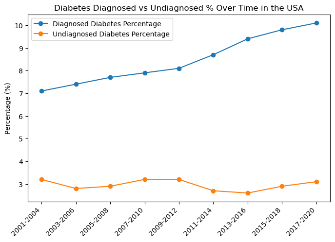

# Diabetes USA Market Analysis

## Overview:

Welcome to my analysis of type 2 diabetes, focusing on disease analysis in the USA and Marketing analysis for the top 5 drugs in the US managing this disease. Diabetes mellitus is a condition that happens when your blood sugar (glucose) is too high. It develops when your pancreas doesn’t make enough insulin or any at all, or when your body isn’t responding to the effects of insulin properly. This project was created out of a desire to understand the disease burden, its prevalence, risk factors, occurrence at the county level, and to analyze the marketing strategies of the top 5 drugs. It delves into the disease status in the USA market and companies' marketing performance to help find optimal marketing activities to tackle this disease.

The data was sourced from two separate sources; the USA disease data was sourced from the Centers for Disease Control and Prevention (CDC) website. The disease data contains detailed information on age groups, genders, diagnosed percentage per county, risk factors, obesity percentages/county for US race and ethnicity, Social Vulnerability Index (SVI)/county, and diagnosed/undiagnosed percentages across years. Due to the proprietary nature of pharmaceutical sales/marketing data, this project utilized a simulated dataset that mirrors a real-world scenario. The simulated data was supplemented with real figures for drug sales and marketing expenditures from the company's 10-K filing, as well as trusted blogs on pharma websites, such as xtalks. The data was created to demonstrate my ability to analyze key marketing metrics, including market share, sales trends, and campaign effectiveness. The simulated data contains detailed information on drug name, prescriptions filled, new patients started, sales, marketing spend on digital Ads, marketing spend on Healthcare professionals, and competitors' prescriptions.

## Tools I Used:
For my deep dive into the data analyst job market, I harnessed the power of several key tools:
  - Python: The backbone of my analysis, allowing me to analyze the data and find critical insights. I also used the following Python libraries:
      - Pandas Library: This was used to analyze the data.
      - Matplotlib Library: I used it to visualize the data.
      - Seaborn Library: Helped me create more advanced visuals.
  - Jupyter Notebooks: The tool I used to run my Python scripts, which let me easily include my notes and analysis.
  - Visual Studio Code: My go-to for executing my Python scripts.

## The Questions:
The questions are divided into two parts, the Medical Part and the Marketing Part:
  - Diabetes Disease State Questions:
      - What are the demographic characteristics of the American population with diabetes?
      - What are the most prevalent health risk factors among people with diabetes?
      - How has the percentage of undiagnosed and diagnosed diabetes changed over time in the US?
      - Which US counties have the highest diagnosed diabetes rates, and what is the total population of those counties?
      - What are the top 20 states with the highest overall percentage of diagnosed diabetes?
      - What are the top 20 counties/states with the highest overall cases of diagnosed diabetes?
      - How does the percentage of children in poverty correlate with diagnosed diabetes rates at the county level?
      - Is there a relationship between race and ethnicity and the prevalence of obesity and physical inactivity in a county?
      - What is the relationship between the overall obesity rate and the diagnosed diabetes rate at the county level?
      - Which counties have a high percentage of diagnosed diabetes?
      - Is there a relationship between child Poverty and the prevalence of diabetes? 

## The Analysis:
The Jupyter notebook for this part of the project aimed at investigating specific aspects of the US diabetes disease state. Here’s how I approached each question:

### What are the demographic characteristics of the American population with diabetes?

To find the main demographics of the American population with diabetes, I filtered the data for the age groups of diabetes diagnosed/undiagnosed, then I filtered for the gender diagnosed/undiagnosed diabetes percentage, and then for the percentage of diabetes diagnosed for each ethnic group. I plotted a subplots bar chart for the age group to identify the difference between the groups diagnosed and the undiagnosed numbers. In the same way, I plotted subplot pie charts for the gender data. For the ethnic groups data, I plotted it on a bar chart to demonstrate the differences in diabetes occurrence across different ethnicities.

### Results

### Insights

At first glance at the above graphs, I could realize that:

**Age-Group Insights**

The "Age Groups Diabetes" graph  demonstrates a strong correlation between age and the prevalence of diabetes.
  - The highest age group diagnosed with diabetes is people over 65 years old, with almost 14 million diagnosed cases. Followed by the second-highest age group of people aged from 45 to 64 years old. That means the prevalence of diagnosed, undiagnosed, and total diabetes increases dramatically with age. The highest undiagnosed age group is the age group of 45 to 65 years old.

**Gender Demographics**

The "Diabetes by Gender" graph  reveals a clear distinction in the prevalence of diagnosed, undiagnosed, and total diabetes between men and women.
  - Men have a higher prevalence of total diabetes compared to women. Women show a larger gap between diagnosed and undiagnosed cases. This indicates that a significant portion of diabetes in the female population remains undiagnosed, highlighting a potential need for increased screening and public health outreach targeted at women.

**Race and Ethnicity Demographics**

The "Race and Ethnicity" graph  highlights significant disparities in diabetes rates among different racial and ethnic groups.
  - Hispanic, non-Hispanic Black, and non-Hispanic Asian populations have a higher overall prevalence of diabetes compared to non-Hispanic White populations.

### What are the most prevalent health risk factors among people with diabetes?

The data for the risk factors comes in a separate sheet, and it only needs data processing. Cleaning columns and converting data to numeric type (float). Then plot the data on a bar chart. The chart below is for the risk factors - related complications. Since the CDC Statistics website only provides data for 2 risk factors, obesity and physical inactivity. 

### Results

### Insights

This chart breaks down the percentages of various risk factors for adults diagnosed with diabetes. 

  - **Obesity** is the most widespread risk factor, in which the graph shows that almost 90% of adults with diagnosed diabetes are either overweight or obese (BMI ≥25.0 kg/m²). This is the most prevalent risk factor documented on the chart and should be a primary focus for any intervention or public health campaign.

  - **High blood pressure** is a major concern. A large proportion of the population with diabetes (70.6%) also has high blood pressure, highlighting the interconnectedness of these conditions. This finding suggests a need for a holistic approach to patient care that addresses both blood sugar and blood pressure control.

  - **Poorly managed A1C levels** are highly common, in which a significant percentage (47.4%) of the diabetic population has an A1C level of 7.0% or higher, indicating they are not meeting their glycemic control goals. This points to a critical need for better patient education and management strategies to prevent complications.

  - **Lifestyle** factors like physical inactivity are a significant problem for patients and a leading cause of diabetes. About one-third (31.9%) of adults with diabetes are physically inactive. This is an important, modifiable risk factor that can be targeted through campaigns promoting exercise and physical activity.

  - A substantial portion of the population with diabetes are current or former **smokers**. Around 58% of the population with diabetes are either current or former cigarette smokers, which is another significant risk factor for diabetes-related complications.

### How has the percentage of undiagnosed and diagnosed diabetes changed over time in the US?

        plt.figure(figsize=(8, 5))
        plt.plot(diagnosed_over_time['Time Period'], diagnosed_over_time['Diagnosed_diabetes_Percentage'], marker='o', label='Diagnosed Diabetes Percentage')
        plt.plot(undiagnosed_over_time['Time Period'], undiagnosed_over_time['Undiagnosed_diabetes_Percentage '], marker='o', label='Undiagnosed Diabetes Percentage')
        plt.title('Diabetes Diagnosed vs Undiagnosed % Over Time in the USA')
        plt.legend()
        plt.ylabel('Percentage (%)')
        plt.xticks(rotation = 45, ha = 'right')
        
        plt.show()
        plt.tight_layout()

### Result

