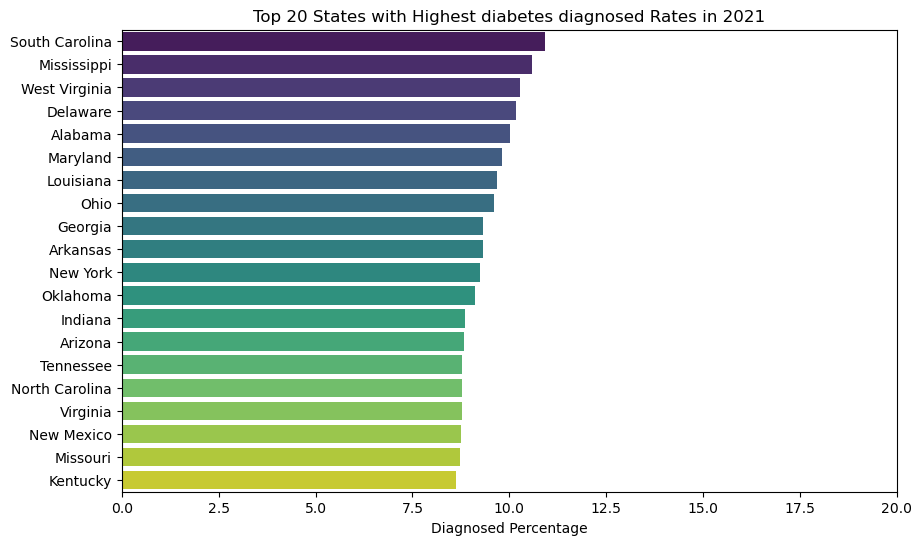

# Diabetes USA Market Analysis

## Overview:

Welcome to my analysis of diabetes mellitus, focusing on disease analysis in the USA and Marketing analysis for the top 5 drugs in the US managing this disease. Diabetes mellitus is a condition that happens when your blood sugar (glucose) is too high. It develops when your pancreas doesn’t make enough insulin or any at all, or when your body isn’t responding to the effects of insulin properly. This project was created out of a desire to understand the disease burden, its prevalence, risk factors, occurrence at the county level, and to analyze the marketing strategies of the top 5 drugs. It delves into the disease status in the USA market and companies' marketing performance to help find optimal marketing activities to tackle this disease.

The data was sourced from two separate sources; the USA disease data was sourced from the Centers for Disease Control and Prevention (CDC) website. The disease data contains detailed information on age groups, genders, diagnosed percentage per county, risk factors, obesity percentages/county for US race and ethnicity, Social Vulnerability Index (SVI)/county, and diagnosed/undiagnosed percentages across years. Due to the proprietary nature of pharmaceutical sales/marketing data, this project utilized a simulated dataset that mirrors a real-world scenario. The simulated data was supplemented with real figures for drug sales and marketing expenditures from the company's 10-K filing, as well as trusted blogs on pharma websites, such as xtalks. The data was created to demonstrate my ability to analyze key marketing metrics, including market share, sales trends, and the effectiveness of campaigns or channels. The simulated data contains detailed information on drug name, company, prescriptions filled, new prescriptions, sales, marketing spend on digital Ads, marketing spend on Healthcare professionals, and prescription(Rx) dates.

## Tools I Used:
For my deep dive into the data analyst job market, I harnessed the power of several key tools:
  - Python: The backbone of my analysis, allowing me to analyze the data and find critical insights. I also used the following Python libraries:
      - Pandas Library: This was used to analyze the data.
      - Matplotlib Library: I used it to visualize the data.
      - Seaborn Library: Helped me create more advanced visuals.
  - Jupyter Notebooks: The tool I used to run my Python scripts, which let me easily include my notes and analysis.
  - Visual Studio Code: My go-to for executing my Python scripts.

## The Questions (A):
The questions are divided into two parts, the Medical Part and the Marketing Part:
  - Diabetes Disease State Questions:
    - What are the demographic characteristics of the American population with diabetes?
    - What are the most prevalent health risk factors among people with diabetes?
    - How has the percentage of undiagnosed and diagnosed diabetes changed over time in the US?
    - Which US counties have the highest diagnosed diabetes cases, and what is the total population of the cases in those counties?
    - What are the top 20 states with the highest overall percentage of diagnosed diabetes?
    - What are the top 20 counties/states with the highest overall cases of diagnosed diabetes?
    - How does the percentage of children in poverty correlate with diagnosed diabetes rates at the county level?
    - What is the relationship between the overall obesity rate and the diagnosed diabetes rate at the county level? 

## The Analysis:
The Jupyter notebook for this part (01_Patient_Profile.ipynb) of the project aimed at investigating specific aspects of the US diabetes disease state. Here’s how I approached each question:

## What are the demographic characteristics of the American population with diabetes?

To identify the main demographics of the American population with diabetes, I filtered the data by age groups of diagnosed/undiagnosed diabetes, then by the percentage of diagnosed/undiagnosed diabetes by gender, and finally by the percentage of diagnosed diabetes for each ethnic group. I plotted a subplots bar chart for the age group to identify the difference between the groups diagnosed and the undiagnosed numbers. In the same way, I plotted subplot pie charts for the gender data. For the ethnic groups data, I plotted it on a bar chart to demonstrate the differences in diabetes occurrence across different ethnicities.

### Results

### Insights

At first glance at the above graphs, I could realize that:

**Age-Group Insights**

The "Age Groups Diabetes" graph  demonstrates a strong correlation between age and the prevalence of diabetes.
  - The highest age group diagnosed with diabetes is people over 65 years old, with almost 14 million diagnosed cases. Followed by the second-highest age group of people aged from 45 to 64 years old. That means the prevalence of diagnosed, undiagnosed, and total diabetes increases dramatically with age. The highest undiagnosed age group is the age group of 45 to 65 years old.

**Gender Demographics**

The "Diabetes by Gender" graph  reveals a clear distinction in the prevalence of diagnosed, undiagnosed, and total diabetes between men and women.
  - Men have a higher prevalence of total diabetes compared to women. Women show a larger gap between diagnosed and undiagnosed cases. This indicates that a significant portion of diabetes in the female population remains undiagnosed, highlighting a potential need for increased screening and public health outreach targeted at women.

**Race and Ethnicity Demographics**

The "Race and Ethnicity" graph  highlights significant disparities in diabetes rates among different racial and ethnic groups.
  - Hispanic, non-Hispanic Black, and non-Hispanic Asian populations have a higher overall prevalence of diabetes compared to non-Hispanic White populations.

## What are the most prevalent health risk factors among people with diabetes?

The data for the risk factors comes in a separate sheet, and it only needs data processing. Cleaning columns and converting data to numeric type (float). Then plot the data on a bar chart. The chart below is for the risk factors - related complications. Since the CDC Statistics website only provides data for 2 risk factors, obesity and physical inactivity. 

    fig, ax = plt.subplots(figsize=(8,6))
    
    # Horizontal bar chart
    bars = ax.barh(
        df_risk_top8['Risk factors for diabetes-related complications'],
        df_risk_top8['Percentage'],
        color=plt.cm.Blues_r(range(len(df_risk_top8)))
    )
    
    # Add percentage labels to bars
    ax.bar_label(bars, fmt='%.1f%%', padding=3, color="black", fontsize=10)
    ax.set_title('% of Risk Factors for Diabetes-related Complications')
    ax.set_xlabel("Percentage")
    ax.set_ylabel("")
    ax.spines['top'].set_visible(False)
    ax.spines['right'].set_visible(False)
    ax.set_xlim(0, 100)
    ax.invert_yaxis()
    plt.tight_layout()
    plt.show()

### Results

### Insights

This chart breaks down the percentages of various risk factors for adults diagnosed with diabetes. 

  - **Obesity** is the most widespread risk factor, in which the graph shows that almost 90% of adults with diagnosed diabetes are either overweight or obese (BMI ≥25.0 kg/m²). This is the most prevalent risk factor documented on the chart and should be a primary focus for any intervention or public health campaign.

  - **High blood pressure** is a major concern. A large proportion of the population with diabetes (70.6%) also has high blood pressure, highlighting the interconnectedness of these conditions. This finding suggests a need for a holistic approach to patient care that addresses both blood sugar and blood pressure control.

  - **Poorly managed A1C levels** are highly common, in which a significant percentage (47.4%) of the diabetic population has an A1C level of 7.0% or higher, indicating they are not meeting their glycemic control goals. This points to a critical need for better patient education and management strategies to prevent complications.

  - **Lifestyle** factors like physical inactivity are a significant problem for patients and a leading cause of diabetes. About one-third (31.9%) of adults with diabetes are physically inactive. This is an important, modifiable risk factor that can be targeted through campaigns promoting exercise and physical activity.

  - A substantial portion of the population with diabetes are current or former **smokers**. Around 58% of the population with diabetes are either current or former cigarette smokers, which is another significant risk factor for diabetes-related complications.

### How has the percentage of undiagnosed and diagnosed diabetes changed over time in the US?

    plt.figure(figsize=(8, 5))
    plt.plot(diagnosed_over_time['Time Period'], diagnosed_over_time['Diagnosed_diabetes_Percentage'], marker='o', label='Diagnosed Diabetes Percentage')
    plt.plot(undiagnosed_over_time['Time Period'], undiagnosed_over_time['Undiagnosed_diabetes_Percentage '], marker='o', label='Undiagnosed Diabetes Percentage')
    plt.title('Diabetes Diagnosed vs Undiagnosed % Over Time in the USA')
    plt.legend()
    plt.ylabel('Percentage (%)')
    plt.xticks(rotation = 45, ha = 'right')
        
    plt.show()
    plt.tight_layout()

### Result

### Insights

  - The most significant trend is the steady increase in the total percentage of people with diabetes over the period. This indicates that diabetes remains a growing public health challenge in the US. The percentage of diagnosed diabetes has consistently risen over time, showing a clear upward trend. 

  - The percentage of undiagnosed diabetes has remained relatively stable, hovering around 2-3% of the population. This is a crucial finding because while a higher number of people are getting diagnosed, there's still a persistent portion of the population that's unaware of their condition.

While the absolute number of undiagnosed cases may be staying the same, the data shows that the proportion of undiagnosed cases relative to total cases is decreasing. This is a positive trend, suggesting that a greater share of people with diabetes are being identified by the healthcare system.

## Which US counties have the highest diagnosed diabetes cases and percentages, and what is the total number of cases in those counties?

## What are the top 20 states with the highest overall percentage of diagnosed diabetes?
    
## What are the top 20 counties/states with the highest overall cases of diagnosed diabetes?

      # calculating the total diagnosed diabetes cases in the top 20 states
    total_diagnosed_cases = full_df[['Diagnosed Diabetes-2021-Percentage', 'State', 'county_population', 'County']]
    total_diagnosed_cases['Total_Cases'] = total_diagnosed_cases['Diagnosed Diabetes-2021-Percentage'] /100 *    total_diagnosed_cases['county_population']

    # Calculating the total diagnosed diabetes cases in the top 20 states based on the percentage of diagnosed cases
    total_diagnosed_cases1 = total_diagnosed_cases.sort_values(by='Diagnosed Diabetes-2021-Percentage', ascending=False).head(20)
    total_diagnosed_cases1['Total_Cases'].sum()

total number of diabetes cases in counties with the highest diagnosis percentage = 311120

total number of diabetes cases in counties with the highest diagnosis cases = 5706690

### Results

### Insights

**Top 20 Counties with the Highest Diabetes Percentage**
  - This chart shows that even within a state, diabetes percentages can vary greatly. The top counties are often clustered in specific regions, such as the Appalachian Mountains and rural areas in the South.

  - This provides a powerful insight where, rather than targeting an entire high-prevalence state, a campaign can be hyper-focused on the specific counties with the highest percentages, maximizing the return on investment.

Actionable Insight: These counties represent the most concentrated "hotspots" of diabetes. They are ideal for community-level interventions, such as local health clinics or mobile screening units.

**Top 20 Counties with the Highest Total Diagnosed Cases**
  - This graph highlights a crucial difference between a percentage-based analysis and a count-based one. The top counties for total cases are almost exclusively major metropolitan areas like Los Angeles County, Cook County (Chicago), and Harris County (Houston). This is because even with a lower diabetes percentage, a massive population will yield a large number of total cases.

  - From a business perspective, these counties represent the largest markets for diabetes-related products and services, such as medications, devices, and health programs.

Actionable Insight: These are the primary targets for large-scale marketing campaigns. The goal here is to capture a piece of the largest available patient population.

**Top 20 States with the Highest Diabetes Percentage**
  - The highest percentages of diagnosed diabetes are concentrated in the Southern United States. States like South Carolina, Mississippi, Alabama, and Arkansas consistently top the list.

  - This pattern suggests a link between diabetes prevalence and rural or socioeconomically disadvantaged areas, which often have limited access to fresh food and healthcare facilities.

Actionable Insight: For a public health campaign focused on prevalence, these states are the priority. The goal would be to address underlying factors in these regions that lead to high diabetes percentages.

## How does the percentage of children in poverty correlate with diagnosed diabetes rates at the county level?

      sub = full_df.dropna(subset=["Diagnosed Diabetes-2021-Percentage","Children in Poverty-2022 & 2018-2022-Percentage"]).copy()
    x = sub["Diagnosed Diabetes-2021-Percentage"].values; y = sub["Children in Poverty-2022 & 2018-2022-Percentage"].values
    coeff = np.polyfit(x, y, 1)
    y_fit = np.polyval(coeff, x)
    print("Slope:", coeff[0], "Intercept:", coeff[1])
    plt.figure(figsize=(7,5))
    plt.scatter(x,y,s=20)
    plt.plot(x, y_fit, linewidth=2)
    plt.xlabel("Diagnosed Diabetes rates"); plt.ylabel("Children in Poverty %")
    plt.title("Diabetes Diagnosed vs Children in Poverty %")
    plt.show()

### Result

### Insights

Notice that as you move from left to right on the x-axis (the diagnosed diabetes rate also increases), the data points generally tend to move upwards on the y-axis (as the percentage of children in poverty increases). This indicates a **positive correlation**.
  - The graph shows a clear positive correlation between the two variables. As the percentage of children in poverty increases, the diagnosed diabetes rate at the county level also tends to increase.
  - This correlation suggests a strong link between socioeconomic factors and diabetes prevalence. Counties with higher levels of poverty may face challenges such as limited access to nutritious food, safe places for physical activity, and quality healthcare, all of which are risk factors for diabetes.

Actionable Insight: For a marketing or public health campaign, this correlation is crucial. It suggests that a targeted approach focusing on areas with high child poverty could be effective in reaching a population that is both at-risk and in need of resources related to diabetes prevention and management.

## What is the relationship between the overall obesity rate and the diagnosed diabetes rate at the county level? 

    sub = full_df.dropna(subset=["Diagnosed Diabetes-2021-Percentage","obesity-2021-Percentage"]).copy()
    x = sub["Diagnosed Diabetes-2021-Percentage"].values; y = sub["obesity-2021-Percentage"].values
    coeff = np.polyfit(x, y, 1)
    y_fit = np.polyval(coeff, x)
    print("Slope:", coeff[0], "Intercept:", coeff[1])
    plt.figure(figsize=(7,5))
    plt.scatter(x,y,s=20)
    plt.plot(x, y_fit, linewidth=2)
    plt.xlabel("Diagnosed Diabetes rates"); plt.ylabel("Obesity %")
    plt.title("Diabetes Diagnosed vs Obesity %")
    plt.show()

### Result

### Insights

  - The most significant observation is the strong positive correlation between obesity rates and diagnosed diabetes rates. As the percentage of obesity increases in a county, the percentage of diagnosed diabetes also increases.

  - The data points form a relatively tight, upward-sloping cloud, suggesting a clear and consistent **linear relationship** between the two variables. This implies that for every increase in obesity, there is a predictable increase in the diabetes rate.

  - This strong correlation suggests that obesity is a primary driver or a major contributing factor to the high rates of diagnosed diabetes at the county level. The visual evidence is compelling enough to conclude that any strategy to combat diabetes should prioritize addressing obesity.

Actionable Insight: This insight is highly valuable since it points to a direct causal link that can be used to frame messaging. A campaign targeting counties with high obesity rates would likely be effective in reaching a population at high risk for diabetes.

## The Questions (B):
  - The questions below are related to the second part of the project, the Marketing analysis for the US Market:
      - Which patient segment has the highest volume of new prescriptions?
      - Do certain patient segments generate higher sales per prescription than others?
      - Is there a specific marketing channel that is more effective at reaching a particular patient segment?
      - What is the average cost of a prescription for each drug?
      - How is the market share distributed among the top pharmaceutical companies based on total sales?
      - Which drug and company combination has the highest daily sales and prescriptions?
      - What is the correlation between marketing spend across all channels and daily sales/new prescriptions?
      - How does marketing spend change over time for the top-selling drugs?
      - Which marketing channel (DTC, HCP, or TV) shows the strongest return on investment (ROI)?
   
## The Analysis:
The Jupyter notebook for this part (02_Marketing_Analysis.ipynb) of the project aimed at investigating the Marketing aspects of the US diabetes drugs. Here’s how I approached each question:

##  Which patient segment has the highest volume of new prescriptions?
This question is identified by grouping patient segments and aggregating the sum of new prescriptions, then plotting the results.

### Result

### Insights
The horizontal bar chart illustrates the total number of new prescriptions for three distinct patient segments: Obesity Comorbidity, Cardiovascular Risk, and Type 2 Newly Diagnosed. The data reveals a clear and significant difference in the volume of new patients in each group, which is a crucial insight for understanding market size and growth potential.
  - The Obesity Comorbidity segment generates the highest volume of new prescriptions by a considerable margin. This indicates that this patient group is the primary driver of new customer acquisition for the brands in the market.
  - Cardiovascular Risk segment generates the second-highest volume of new prescriptions. Its strong performance indicates that patients with cardiovascular risk are also a major target for new prescription acquisition.
  - Type 2 Newly Diagnosed segment has the lowest volume of new prescriptions. This lower volume could be due to several factors, such as newly diagnosed patients being started on more traditional, older, and less expensive treatments like Metformine that are not reflected in the data.

## Do certain patient segments generate higher sales per prescription than others?
This question is solved by creating a new column for the single prescription cost by dividing the daily sales by the daily Rx, then grouping the patient segment by the average Rx cost.

### Result

### Insights
The bar chart compares the average prescription cost across three distinct patient segments: Obesity Comorbidity, Cardiovascular Risk, and Type 2 Newly Diagnosed. The graph reveals a clear difference in the cost of prescriptions for patients with specific health conditions, reflecting the current situation in the US guidelines and FDA approvals, where GLP-1-like Ozempic and Trulicity are used in type 2 diabetes and weight loss (Obesity Comorbidity). These medications are novel to the global market and are currently making a disruption in the diabetes market. 

## Is there a specific marketing channel that is more effective at reaching a particular patient segment?
To identify the effectiveness of the channel, this could be reached by determining the cost of the new Rx for each channel. 

    # We need to calculate the cost of every new rx from every channel spending
    df_marketing['Rx_cost_DTC'] = df_marketing['Marketing_Spend_DTC_Digital'] / df_marketing['New_Prescriptions']
    df_marketing['Rx_cost_HCP'] = df_marketing['Marketing_Spend_HCP_Outreach'] / df_marketing['New_Prescriptions']
    df_marketing['Rx_cost_TV'] = df_marketing['Marketing_Spend_TV_Ads'] / df_marketing['New_Prescriptions']
    
    # Now calculating the avg of Rx cost per channel 
    channel_effectiveness = df_marketing.groupby('Patient_Segment')[['Rx_cost_DTC', 'Rx_cost_HCP', 'Rx_cost_TV']].mean().sort_values(by='Rx_cost_DTC', ascending=False)
    print(channel_effectiveness)

### Result

### Insights
The bar chart compares the effectiveness (in USD) of three distinct marketing channels in driving conversions within three key patient segments. This is a classic cross-channel, cross-segment performance analysis. The more spending in the channel to achieve the conversion or sale is the less effective the channel and vice versa
  - **Direct-to-Consumer DTC:** This includes digital advertising (social media, search engines), email marketing, branded websites, and online patient resources. DTC is likely the second most effective channel for reaching the targeted segments. Best for capturing intent and guiding patients to ask their HCP about the drug.
  - **HCP Outreach Channel:** This includes sales reps detailing physicians, providing samples, medical science liaisons, and professional marketing. HCP Outreach is undoubtedly the top-performing channel for all the segments. It is only going to cost the brand $5 more or less to reach the targeted segment. This is a high-touch, high-value channel designed to influence the prescriber directly.
  - **TV:** National or targeted cable TV commercials. TV is likely the broad awareness play, potentially showing the most balanced performance across all three segments, but with a lower dollar effectiveness per spend than other channels. However, it primes the entire market, making the efforts of the DTC and HCP channels more effective.

## What is the average cost of a prescription for each drug?

    # Since we have created the Rx cost before so we will group drugs directly
    avg_Rxcost_drug = df_marketing.groupby('Drug_Name')['RX_Cost'].mean().sort_values(ascending=False)
    
    # Plotting data 
    plt.bar(avg_Rxcost_drug.index, avg_Rxcost_drug.values)
    
    for i, v in enumerate(avg_Rxcost_drug):
        plt.text(i, v + 1, str(round(v)), ha="center")
    
    plt.gca().spines['top'].set_visible(False)
    plt.gca().spines['right'].set_visible(False)
    plt.title('Avg Rx cost for each Drug')
    plt.xlabel('')
    plt.ylabel('USD')
    plt.tight_layout()
    plt.show()

### Result

### Insights
The bar chart presents the average cost per prescription for seven different brands. The data reveals a significant difference in pricing across the market, which is a key factor in both patient accessibility and a brand's revenue strategy. 
  - High-Cost vs. Low-Cost Brands: There is a clear divide between the high-cost brands (Ozempic, Trulicity, and Mounjaro) and the lower-cost brands (Januvia, Janumet, and Jardiance). This pricing strategy likely reflects differences in drug type, Route of administration, market positioning, and the target patient segment or indication.

## How is the market share distributed among the top pharmaceutical companies based on total sales?
The pie chart below contains only the top 5 brands in the market.

    # Calculating the total sales for each drug 
    market_share = df_marketing.groupby('Drug_Name')['Daily_Sales_USD'].sum().sort_values(ascending=False).head(5)
    # Calculating total market size 
    total_market = round(df_marketing['Daily_Sales_USD'].sum())
    # Calculating the market share percentages for each drug 
    marketshare_Percentage = (market_share / total_market) * 100

### Result

### Insights
The Pie chart provides a clear snapshot of the market share for five different diabetes drugs. The length of each slice represents the percentage of the total market that the brand controls. The visualization reveals a highly competitive market, dominated by a few key players, with a significant disparity between the top brands and the others.
  - Ozempic: This brand is the undisputed market leader. It has the largest market share, controlling just over 24%. Its near-equal dominance suggests a direct and intense rivalry for the top spot. 
  - Mounjaro and Trulicity: Trulicity and Mounjaro are strong second and third-place competitors. Their market share is significant, at approximately 22% for each, placing them firmly in the top tier behind the market leaders. This indicates a robust market presence and a strong competitive position. Their combined market share represents over 40% of the total market, making them the most influential players.
  - Jardiance: Jardiance holds a solid position, with a market share of around 13%. While not a top-tier leader, its substantial share indicates a stable and recognizable brand with a dedicated customer base.
  - Januvia and Janumet: These two brands occupy the lower tier of the market. Both have a relatively small market share, with Januvia at approximately 7% and Janumet at less than 4%. Their combined share is less than half of Trulicity's, suggesting they are either legacy brands, patients face severe side effects, or niche players that do not compete directly with the market leaders.

## Which drug and company combination has the highest daily sales and prescriptions?

    # Plotting a dual axis graph for the data
    fig, ax1 = plt.subplots(figsize=(9, 6))
    
    # Plot sales on the primary axis
    bar_width = 0.6
    bar_positions = range(len(highest_sales_Rx))
    ax1.bar(bar_positions, highest_sales_Rx['Daily_Sales_USD'], bar_width, color='skyblue', label='Daily Sales (USD)')
    
    # Format the sales axis with dollar signs and commas
    formatter = ticker.FuncFormatter(lambda x, p: f'${x:,.0f}')
    ax1.yaxis.set_major_formatter(formatter)
    ax1.set_xlabel('')
    ax1.set_ylabel('')
    ax1.set_title('Top Drugs by Sales and Prescriptions')
    ax1.set_xticks(bar_positions)
    ax1.set_xticklabels(highest_sales_Rx[('Drug_Company')], rotation=45, ha='right')
    
    # Create a secondary axis for prescriptions
    ax2 = ax1.twinx()
    
    # Plot prescriptions on the secondary axis as a line
    ax2.plot(bar_positions, highest_sales_Rx['Daily_Prescriptions'], marker='o', color='darkblue', linestyle='-', linewidth=2, label='Daily Prescriptions')
    ax2.set_ylabel('Daily Prescriptions')
    ax2.tick_params(axis='y', colors='black')
    
    # Add a combined legend
    lines, labels = ax1.get_legend_handles_labels()
    lines2, labels2 = ax2.get_legend_handles_labels()
    ax2.legend(lines + lines2, labels + labels2, loc='upper right')
    
    plt.tight_layout()
    
    plt.show()

### Result

### Insights
The dual-axis chart effectively compares the performance of several drugs across two key metrics: Total Sales (USD) and Total New Prescriptions. The visual separation of these metrics for each drug allows for a direct comparison of their market success and patient adoption. A key takeaway is the strong positive relationship between sales and new prescriptions. Drugs with higher sales generally have a higher number of new prescriptions, and vice versa. This indicates that the sales volume is directly tied to the number of new patients adopting the drug.
  - Market Leaders: Ozempic, Trulicity, and Mounjaro are the market leaders. Any competitive strategy would need to focus on directly challenging their dominance.
  - Tiered Market: The market appears to be tiered, with a clear gap between the top two drugs, the solid mid-tier performer (Jardiance), and the lower-tier drugs (Januvia, Janumet, and Glucocure). Although Jardiance has an outstanding Rx number exceeding even the market leaders, the total sales are in the mid-tier performer. This is a result of the pricing strategy for Jardiance, where it is the lowest Rx cost across all the competitors. 
The high correlation between sales and prescriptions means that a successful marketing strategy should focus on driving new prescriptions, as this will directly translate into higher sales.

## What is the correlation between marketing spend across all channels and daily sales/new prescriptions?
To determine the relation between these three variables, linear regression is used to answer this question.

    # drop nan values in the needed columns 
    df_marketing = df_marketing.dropna(subset=['Marketing_Spend_HCP_Outreach'])
    
    # Creating new column for the sum of all channels spends
    df_marketing['com_spend'] = df_marketing['Marketing_Spend_HCP_Outreach'] + df_marketing['Marketing_Spend_DTC_Digital'] + df_marketing['Marketing_Spend_TV_Ads']
    
    # Plotting 2 scattered plot for the total spend vs sales and total spend vs new rx
    sub1 = (df_marketing[['com_spend','Daily_Sales_USD']]).copy()
    sub2 = (df_marketing[['com_spend','New_Prescriptions']]).copy()
    a = sub1['com_spend'].values; b = sub1['Daily_Sales_USD'].values
    c = sub2['com_spend'].values; d = sub2['New_Prescriptions'].values
    
    fig, ax = plt.subplots(2, 1, figsize=(12, 10))
    
    # Linear regression calculation
    coeff1 = np.polyfit(a, b, 1)
    b_fit = np.polyval(coeff1, a)
    coeff2 = np.polyfit(c, d, 1)
    d_fit = np.polyval(coeff2, c)
    print("Slope:", coeff1[0], "Intercept:", coeff1[1])
    print("Slope:", coeff2[0], "Intercept:", coeff2[1])

### Result

### Insights
Both graphs show a clear positive relationship between total marketing spend and outcomes (sales and new prescriptions). This indicates highly efficient and predictable marketing performance with no signs of diminishing returns within the current budget range. The strategy is working exceptionally well and is likely scalable. The tight clustering of points around the imaginary trend line means marketing spend is a primary and reliable driver of both sales and new Rx.
  - Sales Insights: The Slope (4.092) is the ROI Multiplier, which means that for every $1 spent, it generates $4.09 in sales. This is an outstanding return and indicates that proper messaging, targeting, and channel selection are effectively driving revenue. While the Intercept ($1,422) is the "Baseline Brand Health" metric. This represents daily sales that occur without the influence of this specific marketing campaign/spending. 
  - New RX Insights: The Slope (0.0255) defines the Cost Per Acquisition (CPA). The brand acquires 0.0255 new prescriptions for every $1 spent. Which means that the CPA, or the cost for a new Rx, is $39.22. While The Intercept (266 New Rx) is significant. This means that the brand or drug has strong inherent demand. Over 250 new prescriptions are written daily without any marketing push, likely due to doctor preferences, clinical reputation, or other non-paid factors.

The entire current spend range ($0-$50k) is highly efficient. Brands can confidently maintain or increase budget within this range, expecting linear returns. To improve the New Prescription slope, brands should focus on converting more of their marketing touches into scripts. This could involve A/B testing ad creative, simplifying the call-to-action, or improving targeting to reach more receptive audiences.

## How does marketing spend change over time for the top-selling drugs?

    # Cleaning date column and converting it to months
    df_marketing['month_n'] = df_marketing['Date'].dt.month
    df_marketing['month'] = df_marketing['month_n'].apply(lambda x: pd.to_datetime(x, format='%m').strftime('%b'))
    # grouping date, drugs and total spend for all channels
    spend_overtime = df_marketing.groupby(['month_n', 'month', 'Drug_Name'])['com_spend'].sum().reset_index()
    
    # Pivotting the grouped data in one table
    df_pivot = spend_overtime.pivot_table(index='month', columns='Drug_Name', values='com_spend')
    
    # Sort the index in chronological order
    month_order = ['Jan', 'Feb', 'Mar', 'Apr', 'May', 'Jun', 'Jul', 'Aug']
    df_pivot = df_pivot.reindex(month_order)

### Result

### Insights
The graph shows a wide variation of spending strategies for brands from January to August. The brands do not follow a uniform pattern; some increase their spend, some decrease it, and others maintain a relatively steady budget. This suggests different marketing campaigns are running with varying timelines and priorities.
  - Top-Tier Spenders (Ozempic, Trulicity, Mounjaro): These three brands are the clear leaders in marketing spend. Their trend lines show a steep and consistent upward trajectory from January to August. This indicates an aggressive, high-investment strategy aimed at either launching new campaigns or solidifying a dominant market position. The high spend suggests a focus on rapid growth and brand awareness.
  - Mid-Tier Spender (Jardiance): The line for Jardiance shows a steady but more moderate increase in spending. While it's not at the same level as the top three, its consistent upward trend suggests a strategy of sustained growth rather than a one-time surge.
  - Maintenance Spenders (Januvia, Janumet): The trend lines for Januvia and Janumet are relatively flat. Their spending remains consistent throughout the eight months. This is characteristic of a marketing strategy focused on maintaining existing market share and brand relevance rather than aggressive expansion.

The marketing landscape shown in the graph is segmented into distinct strategies: a high-investment, growth-focused approach by Ozempic, Trulicity, and Mounjaro, a steady and incremental growth strategy from Jardiance, and a market-maintenance approach from Januvia and Janumet.

##  Which marketing channel (DTC, HCP, or TV) shows the strongest return on investment (ROI)?
To determine the return on investment (ROI) for each marketing channel, I calculated the relationship between spending and the resulting changes in both sales and new prescriptions using linear regression. This method determines how many dollars of sales or new prescriptions are generated for every dollar spent on a given channel.

### Result

### Insights

1. ROI on Sales
   - Marketing_Spend_HCP_Outreach: An ROI of 16.73, meaning for every dollar spent on this channel, approximately $16.73 in sales is generated.
   - Marketing_Spend_DTC_Digital: An ROI of 12.12, meaning for every dollar spent on this channel, approximately $12.12 in sales is generated.
   - Marketing_Spend_TV_Ads: An ROI of 7.96, meaning for every dollar spent on this channel, approximately $7.96 in sales is generated.

2. ROI on New Prescriptions
   - Marketing_Spend_HCP_Outreach: An ROI of 0.105, meaning for every dollar spent on this channel, approximately 0.105 new prescriptions are generated.
   - Marketing_Spend_DTC_Digital: An ROI of 0.076, meaning for every dollar spent on this channel, approximately 0.076 new prescriptions are generated.
   - Marketing_Spend_TV_Ads: An ROI of 0.050, meaning for every dollar spent on this channel, approximately 0.050 new prescriptions are generated.

Based on the analysis, the most effective channel is HCP Outreach, followed by DTC Digital, with TV Ads being the least effective. The HCP Outreach channel shows the strongest return on investment for both sales and new prescriptions. It consistently outperforms the DTC Digital and TV Ads channels. This indicates that targeting healthcare professionals is the most effective marketing communication channel for this dataset. In conclusion, the companies should allocate more budget to the HCP outreach channels with marketing activities like increasing HCP engagement through the Representative visits, Rep-triggered emails, websites, invitations to events and medical conferences, and most importantly, updating HCPs with the new publications related to the promoted drug, as well as building a trustworthy business relationship with the company and brand.
